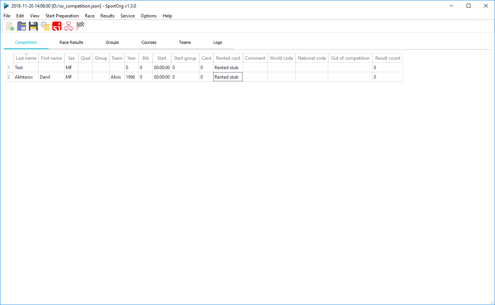
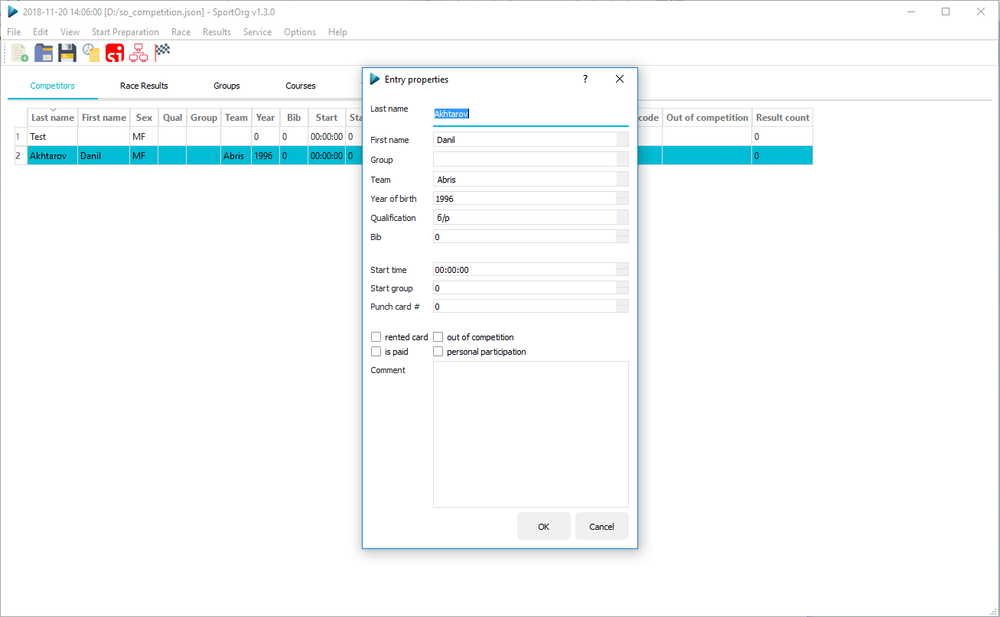
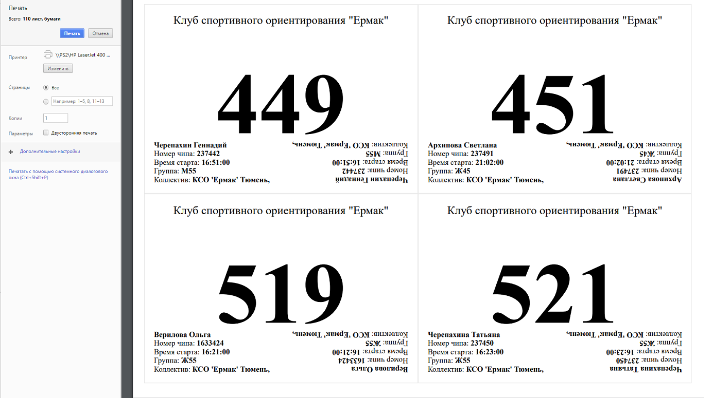

[](https://travis-ci.com/sportorg/pysport)
[](https://www.python.org/downloads/)
[](https://github.com/sportorg/pysport/blob/develop/LICENSE)
[](https://github.com/sportorg)
[](https://github.com/sportorg/pysport)
[](https://github.com/sportorg/pysport)

# SkiOrg (SportOrg Fork)
Especially reconfigured for alpine ski competition.
- 
- [ ] Splits GUI removed
- [ ] No start time
- [ ] First run and second run introduced
- [ ] Modified Telegram functionality (Ctrl+T fast shortcut), help legend
- [ ] Modified Reports (Start List and preliminary results)
- [ ] Fixed ini file


```commandline
pip install poetry
poetry install
poetry install -E win  # for Windows
```

Run

Add `DEBUG=True` to `.env` file or `cp .env.example .env`

```commandline
poetry run python SportOrg.pyw
```







## build

### cx_Freeze

`python setup_.py build`


## Roadmap

- [ ] Publish to pypi
- [ ] Deploy to telegram
