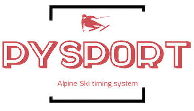
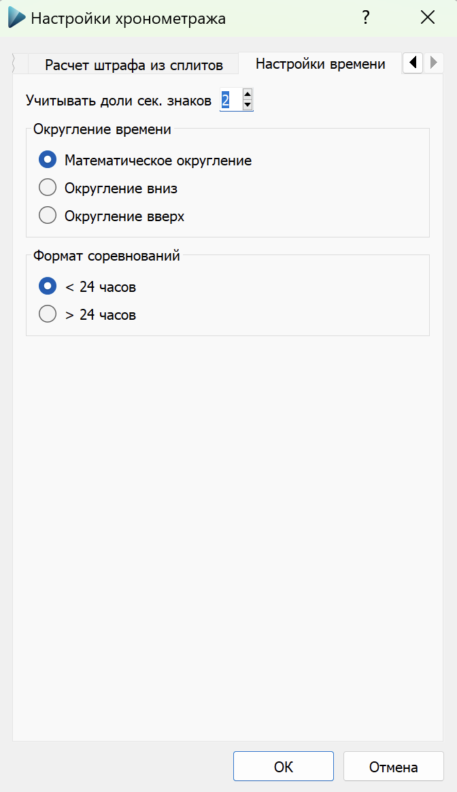
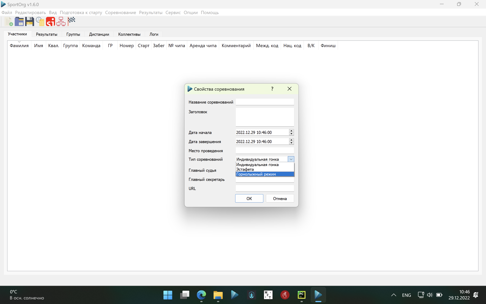
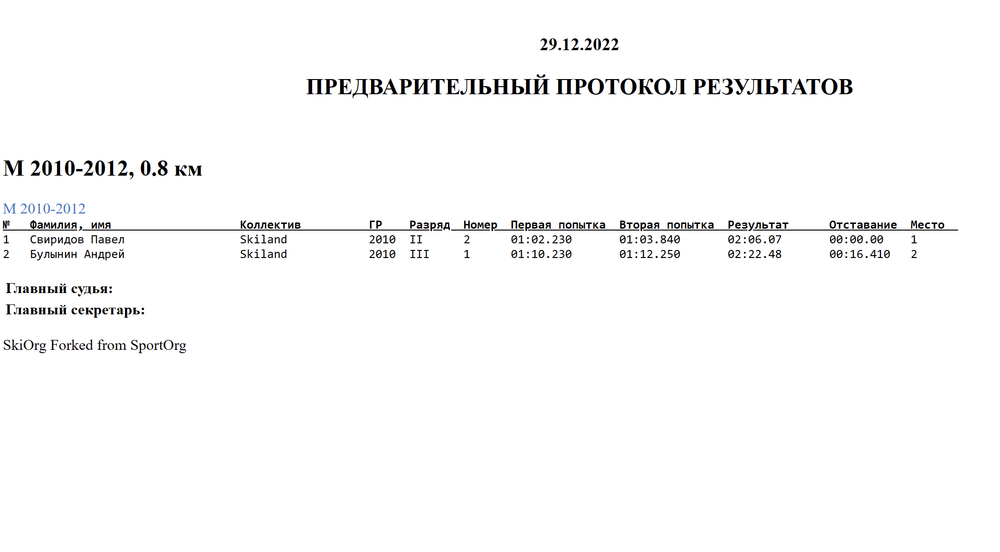
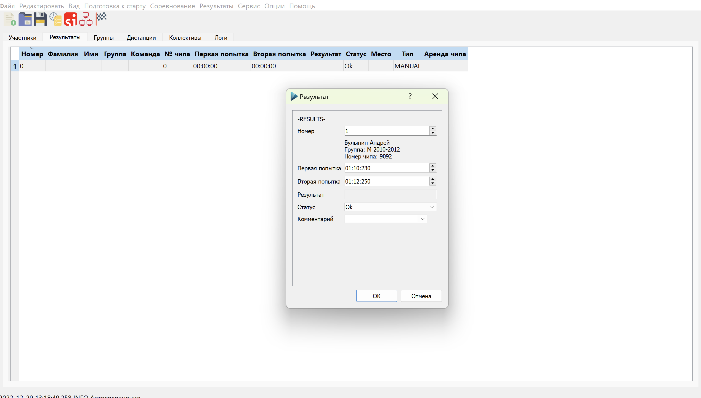

[](https://travis-ci.com/sportorg/pysport)
[](https://www.python.org/downloads/)
[](https://github.com/sportorg/pysport/blob/develop/LICENSE)
[](https://github.com/sportorg)
[](https://github.com/sportorg/pysport)
[](https://github.com/sportorg/pysport)



# PySport v1.6.1 (SportOrg Fork)

Especially reconfigured for alpine ski competition.
- 

- [ ] Splits GUI removed
- [ ] No start time
- [ ] First run and second run introduced
- [ ] Modified Telegram functionality (Ctrl+T fast shortcut), help legend
- [ ] Modified Reports (Start List and preliminary results)
- [ ] Fixed ini file


```commandline
pip install poetry
poetry install
poetry install -E win  # for Windows
```

Run

Add `DEBUG=True` to `.env` file or `cp .env.example .env`

```commandline
poetry run python SportOrg.pyw
```
# Setup Alpine Ski mode
- [ ] Set two decimals in time control settings

 
- [ ] Setup Alpine Ski mode in competition settings


- [ ] Refactored preliminary results protocol


- [ ] Now you-re able to input result in alpine ski fashion
  

## build

### cx_Freeze

`python setup_.py build`

## HiDPI issue

`To fix small fonts on HiDPI displays run following in command line`

```commandline
setx QT_AUTO_SCREEN_SCALE_FACTOR "1"
setx QT_AUTO_SCREEN_SCALE_FACTOR "1" /M
setx QT_FONT_DPI "196"
```

## Roadmap

- [ ] Publish to pypi
- [ ] Finish proprietary timing system module (LoRa to USB)
